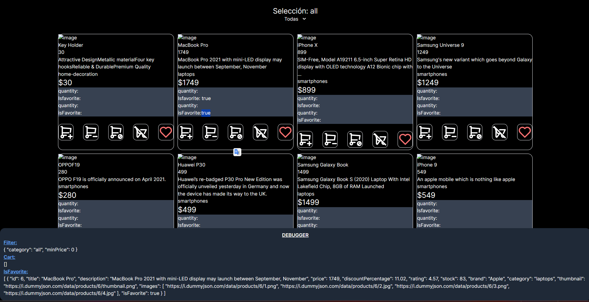

 
    
<h3 >Tienda más Contexto en ReactJS</h3>

Implementa un sistema de filtros para el carrito y la sección de favoritos, junto con funciones para añadir y eliminar productos del carrito

Mi web 😁 "https://toscadev.com/"

    
     
     

    

Este proyecto es una práctica para crear una tienda online utilizando el contexto de React como estado global. Implementa un sistema de filtros para el carrito y la sección de favoritos, junto con funciones para añadir y eliminar productos del carrito.:

### Características:

Contexto de React como estado global:

- Permite un manejo eficiente del estado de la aplicación en diferentes componentes.
- Filtros de carrito y favoritos: Permite a los usuarios refinar la búsqueda de productos.

Funciones para el carrito:

- Añadir producto al carrito.
- Eliminar producto del carrito.
- Elinimar todos los productos del carrito.

Favoritos

- togleFavorite añade el acmpo is favorite al objeto cart

## Instalación

1. Clona este repositorio:
2. Instala las dependencias:
   `npm install`
3. Ejecuta el proyecto:
   `npm run dev`
4. Ajusta el proyecto a tus necesidades 😁

## Mantén el contexto ligero:

Evita almacenar grandes cantidades de datos en el contexto. Solo guarda la información esencial que necesita ser compartida entre diferentes componentes.
Utiliza estructuras de datos eficientes:
Usa estructuras de datos como objetos simples o arrays en lugar de objetos complejos o colecciones anidadas. para evitar problemas de rendimiento

## Considera alternativas:

Para evitar problemas de rendimiento si las estructuras de datos crecen mucho considera alternativas como

- Zustand: Zustan es una biblioteca de gestión de estado ligera y fácil de usar que puede ser una buena alternativa al contexto en algunos casos.
- Redux: Redux es una biblioteca de gestión de estado más compleja pero también más potente que puede ser una mejor opción para aplicaciones grandes con un estado complejo.
